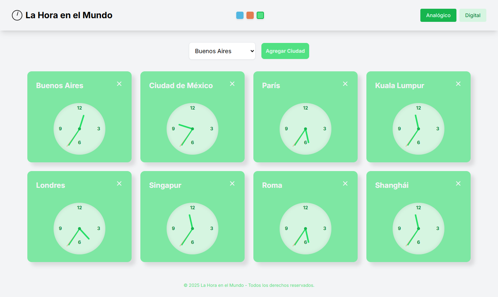

# 🌐 La Hora en el Mundo

Una aplicación web simple y elegante para visualizar la hora actual en diferentes ciudades del mundo. Perfecta para quienes necesitan hacer un seguimiento de la hora global para trabajo, viajes o simplemente por curiosidad.

---

## 🚀 Características Principales

* **Relojes Globales**: Añade y monitoriza la hora de hasta 8 ciudades diferentes alrededor del mundo.
* **Visualización Doble**: Cambia entre una vista de reloj **analógico** y una **digital** con un solo clic.
* **Reordenar Relojes**: Arrastra y suelta los relojes para reorganizar su orden en la interfaz. La aplicación recuerda tu disposición preferida.
* **Personalización**: Cambia el tema de color de la interfaz con un selector de paletas (azul, rojo y verde).
* **Diseño Responsivo**: Disfruta de una experiencia fluida en cualquier dispositivo, ya sea de escritorio, tableta o móvil.
* **Funcionalidad Persistente**: La aplicación recuerda las ciudades que has añadido, el tipo de reloj y el tema de color, gracias al almacenamiento local del navegador.

---

## 💻 Tecnologías Utilizadas

Esta aplicación se ha construido con un conjunto minimalista de tecnologías para garantizar un rendimiento rápido y una fácil comprensión.

* **HTML5**: Para la estructura base de la página.
* **Tailwind CSS**: Un framework de CSS de "primero la utilidad" para un diseño rápido y personalizable sin escribir CSS desde cero.
* **JavaScript (Vanilla)**: Toda la lógica de la aplicación (gestión del tiempo, interacciones del usuario, persistencia de datos) está escrita en JavaScript puro, sin librerías ni frameworks adicionales.

---

## ⚙️ Cómo Funciona

La aplicación utiliza la API `Intl.DateTimeFormat` de JavaScript para obtener la hora actual de las ciudades seleccionadas según su zona horaria (`timeZone`).

1.  El archivo `index.html` carga una lista predefinida de ciudades con sus zonas horarias.
2.  Cuando el usuario añade una ciudad, se crea una nueva "tarjeta de reloj" en el DOM.
3.  Un temporizador (`setInterval`) se activa para cada reloj, actualizando la hora cada segundo.
4.  Dependiendo de si la vista es digital o analógica, se manipulan los elementos HTML correspondientes (un `div` para la vista digital o las manecillas (`hands`) para la vista analógica) para reflejar la hora correcta.
5.  Para la funcionalidad de arrastre, se utiliza el atributo `draggable="true"` y la API de Drag and Drop de HTML. El contenedor principal escucha los eventos (`dragstart`, `dragover`, `dragend`) y manipula el DOM para reordenar las tarjetas. La nueva disposición se guarda inmediatamente en el **almacenamiento local** del navegador.
6.  El estado de la aplicación (ciudades añadidas, tipo de reloj y paleta de colores) se guarda en el **almacenamiento local** del navegador para que se conserve entre sesiones.

---

## 📦 Instalación y Uso

Dado que es una aplicación de una sola página sin dependencias de backend, es muy fácil de usar y desplegar.

1.  Clona el repositorio o descarga el archivo `index.html`.
2.  Abre el archivo `index.html` en tu navegador web. ¡Eso es todo! La aplicación funcionará de inmediato.

No se requiere ningún paso de instalación o compilación.

---

## 📜 Licencia

Esta aplicación está bajo la licencia **MIT**. Consulta el archivo `LICENSE` (si existe) para más detalles.

