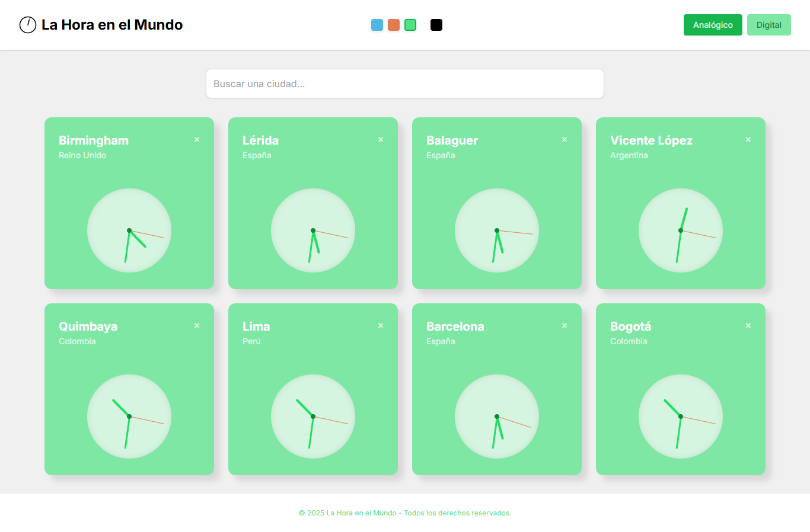

# 🌐 La Hora en el Mundo

Una aplicación web elegante y ligera para visualizar la hora actual en diferentes ciudades del mundo. Ideal para usuarios que necesitan monitorear zonas horarias internacionales para trabajo, viajes o curiosidad.

---

## 🚀 Características Principales

* **Relojes Globales**: Añade y sigue la hora de hasta 8 ciudades alrededor del mundo.
* **Vista Dual**: Alterna fácilmente entre **reloj digital** y **reloj analógico**.
* **Reordenar Relojes**: Arrastra y suelta los relojes para reorganizar su orden. La app recuerda tu disposición preferida.
* **Personalización de Tema**: Cambia la paleta de colores (azul, rojo, verde) y activa el modo oscuro.
* **Diseño Responsivo**: Funciona perfectamente en escritorio, tabletas y móviles.
* **Persistencia**: La app recuerda las ciudades, tipo de reloj y tema de color usando el **almacenamiento local** del navegador.

---

## 💻 Tecnologías Utilizadas

* **HTML5**: Estructura de la página.
* **Tailwind CSS**: Framework de utilidades CSS para un diseño rápido y personalizable.
* **JavaScript (Vanilla)**: Toda la lógica (gestión de tiempo, interacción de usuario, persistencia de datos) está escrita en JavaScript puro.
* **Drag & Drop API**: Para reordenar las tarjetas de los relojes.
* **LocalStorage**: Para guardar la configuración y ciudades añadidas entre sesiones.

---

## ⚙️ Cómo Funciona

1. `index.html` contiene una lista inicial de ciudades con sus zonas horarias (`timeZone`).
2. Al añadir una ciudad, se crea dinámicamente una **tarjeta de reloj** en el DOM.
3. Cada reloj se actualiza cada segundo mediante `setInterval`.
4. Dependiendo de la vista:
   * **Digital**: Se actualiza un `
` con la hora formateada.
   * **Analógico**: Se rotan las manecillas (`hour`, `minute`, `second`) para mostrar la hora correcta.
5. **Reordenamiento**: Se puede arrastrar y soltar cada tarjeta. La disposición se guarda en **LocalStorage**.
6. El **estado de la app** (ciudades, vista, tema) se mantiene entre sesiones mediante **LocalStorage**.

---

## 📦 Instalación y Uso

1. Clona el repositorio o descarga el archivo `index.html`.
2. Abre `index.html` en tu navegador.  
   La aplicación funcionará inmediatamente, no se requiere instalación ni compilación.

---

## 📜 Licencia

Esta aplicación está bajo la licencia **MIT**. Consulta el archivo `LICENSE` para más información.
